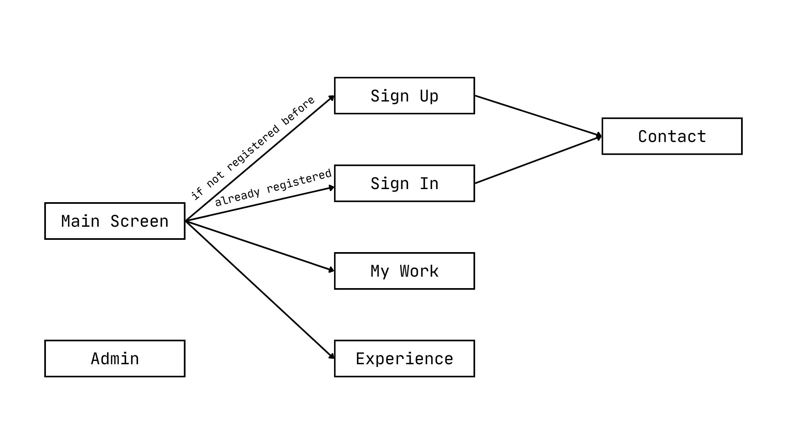

# CS-391-Project-Personal-Website
This is a personal website project prepared within the scope of CS 391 course, using pure HTML, CSS and JavaScript.

### Project Description
Our project is a comprehensive personal website for a friend of ours designed to showcase professional experience, projects, and personal insights. Users are able to see a brief introduction to Berkecan on the Main Screen page. They can check his projects and work experience on the My Work and Experience pages respectively. Our website also allows users to contact Berkecan on the Contact page and enables them to sign in or sign up for the website depending on whether they registered before. This functionality is provided on the Sign In and Sign Up pages. Finally, the Admin page is not visible in the navigation bar but is reachable by typing the URL of the Admin.html page's location. This is a design choice to avoid users entering the Admin page, since Admin page deploys crucial operations such as storing all members registered, and updating and deleting their information.

### Usage Scenarios

**Scenario 1:** Checking the projects

1. User is in the Main Menu.
2. User clicks the My Work tab at the navigation bar.
   

**Scenario 2:** Checking the professional experience

1. User is in the Main Menu.
2. User clicks the Experience tab at the navigation bar.
3. User can see any experience of the website owner by hovering over a dot in the timeline.

**Scenario 3:** Contacting the website owner

1. User is in the Main Menu.
2. User clicks the Contact tab at the navigation bar.
3. User types in their email address, full name, and message.
*User should be registered in the website to contact the owner.*
4. User clicks the submit button.

**Scenario 4:** Signing up to the website

1. User is in the Main Menu.
2. User clicks the Sign Up tab at the navigation bar.
3. User types in their full name, email address, and their password twice to confirm the account.
4. User clicks the Create account button.
5. A message pops up to say that the user has successfully registered. 

**Scenario 5:** Signing in the website

1. User is in the Main Menu.
2. User clicks the Sign In tab at the navigation bar.
3. User types in their email address and password if they are already registered.
4. User clicks the Sign In button.
5. A message pops up to say that the user has successfully signed in the website.

### Project members

**Çağla Cengiz:** 

- Design of the website 
- Created HTML, CSS, and JavaScript files of Admin, Contact, My Work and Experience pages

**Deniz Naz Altaş:** 
- Created HTML, CSS, and JavaScript files of Main Screen, Sign In and Sign Up pages
- Responsive web design
